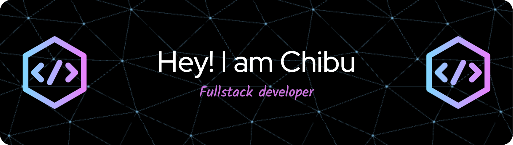

  

 
 

I'm a recent graduate of Lighthouse Labs Web Dev bootcamp, with a background in Civil Engineering and project management. Always curious and eager to learn more about development.
Don't hesitate to reach out to me for collaborations and projects.

 

## Tech Stack

<!-- html5 -->
 
<!-- css -->

<!-- sass -->
 
<!-- Vanilla JS -->
 
<!-- react -->

<!-- Redux -->

 
<!--node JS  -->
 
<!-- express -->

<!-- heroku -->

<!-- Netlify -->

<!-- postgres -->
 
<!-- mongoDB -->
 
 
<!-- git -->

<!-- npm -->
 
<!-- ruby on rails -->
 
<!-- ruby -->
 
<!-- jquery -->
 
<!-- Bootstrap -->

<!-- Figma -->
 
 
<!-- Jest -->
 
<!-- Mocha Chai -->

<!-- storybook -->

  

